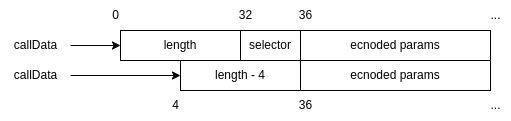

# ABI Decode With Selector
- [📜 Example Code](./ApproveRestrictedWallet.sol)
- [🐞 Tests](../../test/ApproveRestrictedWallet.t.sol)

[ABI-encoding](https://docs.soliditylang.org/en/v0.8.19/abi-spec.html#argument-encoding) is the ubiquitous encoding scheme used throughout solidity whenever it needs to pass around arbitrary typed data through EVM constructs that only understand raw bytes. Function calls, revert errors, and unindexed event data all utilize ABI-encoding under the hood. The `abi.encode()` built-in function lets you encode your own data using this scheme.  

```solidity
// Encode a (uint256,address) tuple
bytes memory encoded = abi.encode(
    uint256(123),
    address(0xF0e20f3Be40923b0C720e61A75Fb6940A3929019)
);
// encoded == hex"000000000000000000000000000000000000000000000000000000000000007b000000000000000000000000f0e20f3be40923b0c720e61a75fb6940a3929019"
```

The `abi.decode()` built-in function is the inverse of `abi.encode()`, taking arbitrary, ABI-encoded data and unpacking it into its original values, provided you know the encoded types in advance.

```solidity
// Decodes to x = 123, a = 0xF0e20f3Be40923b0C720e61A75Fb6940A3929019
(uint256 x, address a) = abi.decode(encoded, (uint256, address));
```

But often when processing raw function calls and revert errors you first need to identify the function or revert error before assuming how the parameter data is encoded. That's why, for function calls and revert errors, the ABI-encoded parameters are also prefixed with a 4-byte "selector", identifying the function or revert error type. This is exactly what the `abi.encodeWithSelector()` and `abi.encodeCall()` built-ins do.

There is no neat, built-in inverse function for `abi.encodeWithSelector()` because decoding this kind of data is actually a two-step process. But there is nothing stopping you from implementing it yourself, which is what we'll explore next.

## Case Study: Restricting approve() Calls

Say we're writing a smart contract wallet. Our wallet contract has an `exec()` function that takes arbitrary function call data and simply executes it as if it were coming from itself.

```solidity
function exec(address payable callTarget, bytes calldata fnCallData, uint256 callValue)
    external
    onlyOwner
{
    (bool s,) = callTarget.call{value: callValue}(fnCallData);
    require(s, 'exec failed');
}
```

Maybe we want to protect this wallet from phishing scams by only allowing pre-approved addresses to be granted an ERC20 allowance. To do this, we want to look at `fnCallData`, detecting calls to the ERC20 `approve()` function, parsing the parameters and making sure the spender is on our list. The steps we'll follow are:

1. Parse the leading 4-byte selector.
2. If the selector is the same as the one for `ERC20.approve`, decode the parameters.
    1. Check that the decoded `spender` is on the allowed list.

Because `fnCallData` parameter is located in `calldata` (not `memory`), the code is pretty concise:
 
```solidity
// Compare the first 4 bytes (selector) of fnCallData.
if (bytes4(fnCallData) == ERC20.approve.selector) {
    // ABI-decode the remaining bytes of fnCallData as IERC20.approve() parameters
    // using a calldata array slice to remove the leading 4 bytes.
    (address spender, uint256 allowance) = abi.decode(fnCallData[4:], (address, uint256));
    require(isAllowedSpender[spender], 'not an allowed spender');
}
```

### The `memory` Catch
The prior implementation is neat thanks to solidity having native support for `calldata` [array slices](https://docs.soliditylang.org/en/v0.8.19/types.html#array-slices) (the `[4:]` syntax), but slices *only* work for `calldata` arrays. This means that if the `fnCallData` array lives in `memory` instead of `calldata`, you cannot use slices.

At this point you can either perform the ABI-decoding yourself manually (🤮), clone the rest of the array to pass into `abi.decode()` (💸), or temporarily modify the array in-place to skip the selector and pass that into `abi.decode()` (🤗). Let's demonstrate the last one since it's the most interesting:

```solidity
// Note that now fnCallData is in memory.
function exec(address payable callTarget, bytes memory fnCallData, uint256 callValue)
    external
    onlyOwner
{
    // Compare the first 4 bytes (selector) of fnCallData.
    if (bytes4(fnCallData) == ERC20.approve.selector) {
        // Since fnCallData is located in memory now, we cannot use calldata slices.
        // Modify the array data in-place to shift the start 4 bytes.
        bytes32 oldBits;
        assembly {
            let len := mload(fnCallData)
            fnCallData := add(fnCallData, 4)
            oldBits := mload(fnCallData)
            mstore(fnCallData, sub(len, 4))
        }
        // ABI-decode fnCallData as ERC20.approve() parameters. 
        (address spender, uint256 allowance) = abi.decode(fnCallData, (address, uint256));
        // Undo the array modification.
        assembly {
            mstore(fnCallData, oldBits)
            fnCallData := sub(fnCallData, 4)
        }
        require(isAllowedSpender[spender], 'not an allowed spender');
    }
    // rest of function ...
}
```

The above trick works because a `bytes` array variable points to a memory location where the first 32 bytes are occupied by the array length, with the actual byte data immediately following.



## The Demo Code
The [included demo](./ApproveRestrictedWallet.sol) is a simple smart contract wallet following the case study. There are two variants of the contract (both inheriting from a common abstract base) that each have a different location for `fnCallData` (`calldata` vs `memory`)  to demonstrate both implementations.
