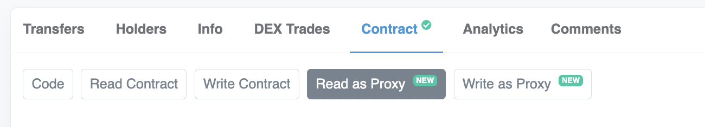

# Basic Proxies

- [📜 Example Code](./ProxyWallet.sol)
- [🐞 Tests](../../test/ProxyWallet.t.sol)

Typically a smart contract's logic (bytecode) cannot change once it's been deployed. For many people that is a good thing because it mitigates the developer's ability to change the rules out from under users. But more complex, fast moving protocols often need more flexibility. The proxy pattern allows developers to replace the logic of a contract even after it has been deployed. Proxy patterns are generally used to satisfy any of the following needs/scenarios:

- **Iterative development**: By replacing the logic of a deployed contract in-place, you can add new features/functions to your contract without having to migrate users, allowances, or balances.
- **Cheaper deployments**: If you find yourself deploying the same contract multiple times, using a proxy pattern can significantly reduce deployment costs because the logic bytecode is stored elsewhere and only needs to be deployed once.
- **Code size limits**: Ethereum has a ~24KB maximum code size limit for a deployed contract, which is surprisingly easy to exceed with complex protocols. Logic in proxy architectures can be spread across multiple contracts so no single contract exceeds the bytecode size limit.

## How It Works

Let's dive into what it takes to implement a basic proxy from scratch. The proxy pattern leverages two features of the EVM/solidity: delegatecalls and fallback functions.

### `delegatecall()`
In solidity, a normal function call made to another contract compiles down to using either the `address.call()`  or `address.staticcall()` semantics. Both of these call types will execute the function in the context of the target contract, meaning it can only access its own state (address, storage, balances, etc).

But if we instead explicitly make a call using `address.delegatecall()`, it will execute the call with the code at `address` *but in the same state context as the caller*. This means any storage reads and writes actually operate on the caller's storage. The target contract will essentially assume the identity of the caller, also inheriting the same `address(this)`, ETH balance, and so on. So any external calls the logic contract makes will also appear as if they're coming from the caller itself. It's as if we replaced our own code with the target contract's code.

### The Fallback Function
Solidity allows you to define a `fallback()` function on your contract. Any calls to undefined functions will trigger this function. Take, for example:

```solidity
function foo() external pure returns (string memory) {
    return 'in foo()';
}

fallback(bytes calldata callData) external returns (bytes memory rawResult) {
    revert('in fallback()');
}
```

If you called `foo()` on the contract, it would return the string `"in foo()"`. But say you cast this contract's address as an ERC20 interface and tried to call `transferFrom()` on it. Because that function is not defined in the contract, the fallback will be triggered and the call would revert with `"in fallback()"`. The value of `callData` in that case would be the ABI-encoded call (function selector + arguments) to `transferFrom()`. If we wanted to return anything from the fallback, we could instead populate `rawResult` with the ABI-encoded return data and return it. 

### Putting It Together
With the proxy pattern, we deploy two contracts: a proxy contract and a logic contract. The logic contract is essentially your user-facing business contract as you would normally write it, but users *should not* interact with it directly. Instead users will interact with the proxy contract, which will forward any calls caught in the fallback to the logic contract using `delegatecall()`.

```
           call     ┌────────────────────┐              ┌────────────────────┐
       Proxy.foo()  │                    │              │                    │
User ───────────────►   Proxy Contract   │              │   Logic Contract   │
                    │                    │              │                    │
 ▲                  ├────────────────────┤ delegatecall └────────────────────┤
 │                  │                    ├──────────────►                    │
 │    foo() result  │     fallback()     │              │       foo()        │
 └──────────────────┤                    ◄──────────────┤                    │
                    ├────────────────────┐              └─────────┬──────────┘
                    │                    │                        │
                    │   storage/state    │                        │
                    │                    ├─ ── ── ── ── ── ── ── ─┘
                    └────────────────────┘       (shared state)
```

These proxy contracts are usually extremely lightweight, since forwarding calls from the fallback is all they really need to do. For example:

```solidity
contract Logic {
    bytes public message;

    function setMessage(bytes calldata message_) external {
        message = message_;
    }
}

contract Proxy {
    address immutable logic;

    constructor(address logic_) { logic = logic_; }

    fallback(bytes calldata callData)
        external
        payable
        returns (bytes memory resultData)
    {
        // forward the unhandled call to the logic contract, executing it in
        // our own state context.
        bool success;
        (success, resultData) = logic.delegatecall(callData);
        if (!success) {
            // bubble up the revert if the call failed.
            assembly { revert(add(resultData, 0x20), mload(resultData)) }
        }
        // Otherwise, the raw resultData will be returned.
    }
}
```

Now if we deploy `Proxy` with the address of an instance of `Logic`, we can treat the instance of `Proxy` as a separate instance of `Logic` and it will behave as such:

```solidity
function test() external returns (string memory msg) {
    // Deploy a Logic contract
    Logic logic = new Logic();
    // Deploy a Proxy contract and set the implementation to the Logic instance.
    Proxy proxy = new Proxy(address(logic));
    // Treat the Proxy instance as a Logic contract.
    Logic proxifiedLogic = Logic(address(proxy));
    // call setMessage() on the Proxy instance, which will execute Logic's code
    // but store the message in the Proxy instance's storage context.
    proxifiedlogic.setMessage("i'm the proxy");
    // returns "i'm the proxy"
    return proxifiedLogic.message();
}
```

### Making Our Proxy Upgradeable
Previously we had stored the logic contract address as a constant, `immutable` field, which embeds its value in the deployed bytecode of the proxy contract and cannot be changed. But we can make it a regular storage variable instead, which allows us to upgrade it later.

When doing so, we need to be *extremely cautious* with defining storage variables in the proxy contract because the compiler is not aware that the `Proxy` and `Logic` contracts will share the same storage context and could assign storage variables in `Logic` to locations that overlap those in `Proxy` (for more context, check out the [explicit storage buckets pattern](../explicit-storage-buckets/)). Specifically for storing the logic address, the recommended approach is to follow either the [EIP-1822](https://eips.ethereum.org/EIPS/eip-1822) or [EIP-1967](https://eips.ethereum.org/EIPS/eip-1967) specifications. Both require using a fixed, explicit (not compiler-assigned) storage slot to store the logic contract address, which we can access with some simple assembly. So to make our proxy conform to EIP-1967, we would do something like:

```solidity
address immutable owner;
// explicit storage slot for logic contract address.
uint256 constant EIP1967_LOGIC_SLOT = 0x360894a13ba1a3210667c828492db98dca3e2076cc3735a920a3ca505d382bbc;

event Upgraded(address indexed logic); // required by EIP-1967

constructor(address logic) {
    owner = msg.sender;
    _setlogic(logic);
}

function upgrade(address logic) external {
    require(msg.sender == owner, 'only owner');
    _setlogic(logic);
}

fallback(bytes calldata callData)
    external
    payable
    returns (bytes memory resultData)
{
    address logic;
    assembly { logic := sload(EIP1967_LOGIC_SLOT) }
    (bool success, bytes memory resultData) = logic.delegatecall(callData);
    // ...same as before
}

function _setlogic(address logic) private {
    emit Upgraded(logic);
    assembly { sstore(EIP1967_LOGIC_SLOT, logic) }
}
```

Etherscan knows to look out for EIP-1967 style proxies and will show users the "read as proxy" and "write as proxy" tabs for interacting with your proxy contract using the logic contract's ABI.



## Pitfalls
As you can see, it's really not that difficult to implement a simple proxy pattern for your contracts. But while this pattern is extremely flexible and powerful, it's also been implicated in many hacks. To use it securely you need to be constantly mindful of the many risks it can introduce.

### Securing The Logic Contract(s)
The logic contract oftentimes is just a regular contract, which someone could directly interact with. This usually doesn't matter because, when used this way, any state changes would only be made on the logic contract's storage/account, not the proxy contract. However, there is one state change that can adversely impact the proxy: a `selfdestruct()`. If someone is able to call `selfdestruct()` on the logic contract directly, the logic contract will be erased, and any proxy contracts that forward their calls to it will start reverting (or, worse, silently succeeding), effectively trapping any funds inside them. This is exactly what happened in the [parity wallet hack](https://blog.openzeppelin.com/on-the-parity-wallet-multisig-hack-405a8c12e8f7/).

### Storage Layout
Extreme care must be taken when upgrading the logic contract of a proxy to ensure that the storage layout remains perfectly compatible with the old logic contract. Changing the order in which storage variables are declared, or the order contracts are inherited, can result in the new logic contract reading and writing to a storage location that previously had an entirely different meaning. To illustrate:

```solidity
contract OldLogic {
    uint256 foo;
    bool canWithdraw;
    
    function incrementFoo() external { ++foo; }

    function withdraw() external {
        require(canWithdraw);
        payable(msg.sender).transfer(address(this).balance);
    }
}

contract NewLogic {
    // Delete `foo`
    bool canWithdraw;

    function withdraw() external {
        // canWithdraw will be non-zero (true) and this function can be called
        // if someone called incrementFoo() when oldlogic was in place!
        require(canWithdraw);
        payable(msg.sender).transfer(address(this).balance);
    }
}
```

To mitigate this situation, as a general rule of thumb, only append new storage variables. Never delete, insert, or prepend them to the final storage layout in new versions of logic contracts. Or, alternatively, [don't rely on the compiler at all to pick your storage slots](./../explicit-storage-buckets/).

### (Re)Initialization
A contract's constructor only gets called when that contract is being deployed, and will always execute in *that* contract's state context. If you need to prepare storage variables in your logic contract's constructor, those state changes will not be reflected in your proxy contract. To get around this, many proxy implementations will move constructor logic into an explicit initialization function that the proxy can explicitly delegatecall into, which will commit those state updates in the proxy's context.

Initialization functions carry some risk. Extreme care must be taken to ensure these initialization functions are guarded so that they cannot be called again. Otherwise someone could, for example, reinitialize your contract, replacing critical configuration options that grant them special privileges.

### Operational Security
The upgrade mechanism of a contract can and should be permissioned to an admin account. The admin account can completely change the logic behind a proxy, making for an easy rug, so that admin account can become extremely attractive for hackers to target. Often projects will put the admin account behind a multisig to mitigate the impact of a compromise, but that is only as secure as the practices followed by the multisig signers. As another line of defense, the upgrade function can be time-locked and monitored so that users and maintainers have time to respond to a malicious logic change.

## The Example
The included [demo contracts](./ProxyWallet.sol) feature a proxified wallet whose original logic only worked with ETH but can be upgraded to a logic contract that can also work with ERC20 tokens. The [tests](../../test/ProxyWallet.t.sol) illustrate how to compose the contracts together.

## Resources
- [OpenZeppelin's Basic Proxy contract](https://github.com/OpenZeppelin/openzeppelin-contracts/blob/master/contracts/proxy/Proxy.sol) and [some considerations around](https://docs.openzeppelin.com/upgrades-plugins/1.x/proxies) it. 
- OpenZeppelin has "upgradeable" versions of many of its libraries, and [guide](https://docs.openzeppelin.com/upgrades-plugins/1.x/writing-upgradeable) on how to use them.
