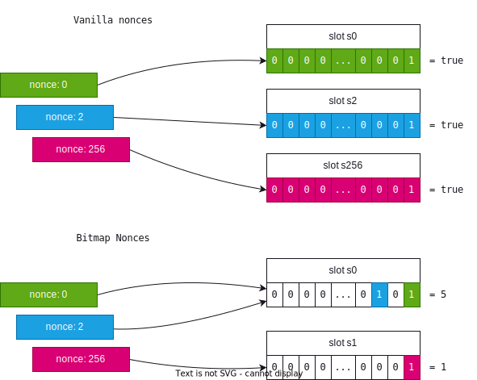

# Bitmap Nonces

- [📜 Example Code](./TransferRelay.sol)
- [🐞 Tests](../../test/TransferRelay.t.sol)

What do filling a stop-loss order, executing a governance proposal, or meta transactions have in common? They're all operations meant to be consumed once and only once. You'll find these kinds of operations across many major protocols. This single-use guarantee needs to be enforced on-chain to prevent replay attacks. To do this, many protocols will derive some unique identifier (nonce) for the operation then map that identifier to a storage slot dedicated to that operation which holds a status flag indicating whether its been consumed or not.

## The Naive Approach

Take the following example of a contract that executes off-chain signed messages to transfer (compliant) ERC20 tokens on behalf of the signer after a given time:

```solidity
contract TransferRelay {
    struct Message {
        address from;
        address to;
        uint256 validAfter;
        IERC20 token;
        uint256 amount;
        uint256 nonce;
    }

    mapping (address => mapping (uint256 => bool)) public isSignerNonceConsumed;

    function executeTransferMessage(
        Message calldata mess,
        uint8 v,
        bytes32 r,
        bytes32 s
    )
        external
    {
        require(mess.from != address(0), 'bad from');
        require(mess.validAfter < block.timestamp, 'not ready');
        require(!isSignerNonceConsumed[mess.from][mess.nonce], 'already consumed');
        {
            bytes32 messHash = keccak256(abi.encode(block.chainid, address(this), mess));
            require(ecrecover(messHash, v, r, s) == mess.from, 'bad signature');
        }
        // Mark the message consumed.
        isSignerNonceConsumed[mess.from][mess.nonce] = true;
        // Perform the transfer.
        mess.token.transferFrom(address(mess.from), mess.to, mess.amount);
    }
}
```

We expect the signer to choose a `nonce` value that is unique across all their messages. Our contract uses this `nonce` value to uniquely identify the message and record its status in the `isSignerNonceConsumed` mapping. Pretty straight-forward and intuitive... but we can do better!

## Examining Gas costs

Let's look at the gas cost associated with marking a message consumed. Because every `Message.nonce` maps to a unique storage slot, we will write to an **empty** slot each time a message gets consumed. Writing to an empty storage slot costs 20k(\*) gas. For context, this can represent 15% of the total gas cost for a simple AMM swap. Especially for high frequency defi operations, the costs can add up. In contrast, writing to a *non-empty* storage slot only costs 3k(\*) gas. Bitmap nonces can minimize how often we write to empty slots, cutting down this cost down by 85% for most operations.

*(\*) Not accounting for EIP-2929 cold/warm state access costs.*

## One More Time, With Bitmap Nonces

If we think about it, we don't need a whole 32-byte word, or even a whole  8-bit boolean to represent whether a message was consumed. We only need one bit (`0` or `1`). So if we wanted to minimize the frequency of writes to empty slots, instead of mapping nonces to an *entire* storage slot, we could map nonces to bit positions within a storage slot. Each storage slot in the EVM is a 32-byte word so we can fit the status of 256 operations inside a single storage slot before we have to move on to the next.



The addressing is done by mapping the upper 248 bits of the `nonce` to a unique slot (similar to before), then map the lower 8 bits to a bit offset inside that slot. If the user assigns nonces to operations incrementally (1, 2, 3, ...) instead of randomly then they will only write to a new slot every 255 operations.

Let's apply bitmap nonces to our contract:

```solidity
contract TransferRelay {
    // ...

    mapping (address => mapping (uint248 => uint256)) public signerNonceBitmap;

    function executeTransferMessage(
        Message calldata mess,
        uint8 v,
        bytes32 r,
        bytes32 s
    )
        external
    {
        require(mess.from != address(0), 'bad from');
        require(mess.validAfter < block.timestamp, 'not ready');
        require(!_getSignerNonceState(mess.from, mess.nonce), 'already consumed');
        {
            bytes32 messHash = keccak256(abi.encode(block.chainid, address(this), mess));
            require(ecrecover(messHash, v, r, s) == mess.from, 'bad signature');
        }
        // Mark the message consumed.
        _setSignerNonce(mess.from, mess.nonce);
        // Perform the transfer.
        mess.token.transferFrom(address(mess.from), mess.to, mess.amount);
    }

    function _getSignerNonceState(address signer, uint256 nonce) private view returns (bool) {
        uint256 bitmap = signerNonceBitmap[signer][uint248(nonce >> 8)];
        return bitmap & (1 << (nonce & 0xFF)) != 0;
    }

    function _setSignerNonce(address signer, uint256 nonce) private {
        signerNonceBitmap[signer][uint248(nonce >> 8)] |= 1 << (nonce & 0xFF);
    }
}
```

## Final Thoughts

- You can find bitmap nonces being used in major protocols such as Uniswap's [Permit2](https://github.com/Uniswap/permit2/blob/cc56ad0f3439c502c246fc5cfcc3db92bb8b7219/src/SignatureTransfer.sol#L142) and 0x's [Exchange Proxy](https://github.com/0xProject/protocol/blob/e66307ba319e8c3e2a456767403298b576abc85e/contracts/zero-ex/contracts/src/features/nft_orders/ERC721OrdersFeature.sol#L662).
- There is no reason you couldn't track operations that have more than 2 states using bitmap nonces. You would just simply increase the number of bits in a word assigned to each operation and adjust the mapping formula accordingly.
- The full, working example can be found [here](./TransferRelay.sol) with complete tests demonstrating its usage and gas savings [here](../../test/TransferRelay.sol).