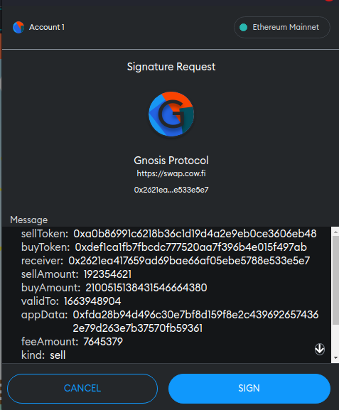

# EIP712 Signed Messages

- Example code:
    - [📜 Conract](./MintVouchers.sol)
    - [🌐 Frontend](https://codesandbox.io/s/compassionate-dust-jgeydc?file=/src/App.vue)
    - [🐞 Contract Tests](../../test/MintVouchers.t.sol)

The [EIP712 standard](https://eips.ethereum.org/EIPS/eip-712) defines a way for a user to sign an arbitrary, human-readable JSON message with their private key. In Metamask, this manifests as a little popup listing all the fields in the message being signed:



 The resulting signature serves as a sort of off-chain attestation by the signer. This signature can be shared off-chain then later consumed on-chain (usually by another party) to perform an action with the user's consent.

## Case Study: Voting

Let's walk through what an implementation (contract + dapp) looks like in practice with a simple governance protocol. This protocol allows people to vote on-chain for some proposal identified by `proposalId`. For simplicity sake, we'll let anyone vote on any proposal ID and only count "yes" votes.

First let's look at how a fully on-chain version would be implemented and iterate on that. The fully on-chain version has a `voteFor()` function which each voter must call directly to cast their vote for a proposal.

```solidity
mapping (uint256 => mapping (address => bool)) public hasVotedForProposalId;
mapping (uint256 => uint256) public yesVotesForProposalId;

...

function voteFor(uint256 proposalId) external {
    // Ensure the voter hasn't already voted on this proposal.
    require(!hasVotedForProposalId[proposalId][msg.sender], 'already voted');
    hasVotedForProposalId[proposalId][msg.sender] = true;
    // Increase vote count for proposal.
    ++yesVotesForProposalId[proposalId];
}
```

With EIP712, we can let people vote without paying gas. Voters sign an off-chain vote message, indicating the proposal ID they want to vote yes for. Someone else can batch these individual signatures up and submit them all at once to be counted on-chain with the `voteForBySignatures()` function. This function accepts corresponding arrays of voters, proposal IDs, and signature components (which are returned by the wallet provider). It loops over each element, doing the following:

1. Ensure that user hasn't already voted.
2. Compute the EIP712 type hash of the corresponding vote message (proposal ID).
3. Check that the corresponding signature for that hash is signed by the voter, using the built-in `ecrecover()` precompile.
4. Increase the votes for that proposal.

```solidity
function voteForBySignatures(
    address[] calldata voters,
    uint256[] calldata proposalIds,
    uint8[] calldata vs,
    bytes32[] calldata rs,
    bytes32[] calldata ss
)
    external
{
    for (uint256 i = 0; i < voters.length; ++i) {
        uint256 proposalId = proposalIds[i];
        address voter = voters[i];
        require(!hasVotedForProposalId[proposalId][voter], 'already voted');
        hasVotedForProposalId[proposalId][voter] = true;
        require(voter == ecrecover(_getVoteHash(proposalId), vs[i], rs[i], ss[i]), 'bad signature');
        ++yesVotesForProposalId[proposalId];
    }
}
```

### The EIP712 Type Hash

The wallet provider (e.g., Metamask) will accept your message fields, condense it into a hash, then sign that hash with the user's private key. This hash must be computed in a specific way, according to the [EIP712 spec](https://eips.ethereum.org/EIPS/eip-712#specification) and ensures that messages from different protocols do not collide. Here we implement the `_getVoteHash()` function, used earlier, to compute the same hash on-chain.

```solidity
function _getVoteHash(uint256 proposalId) private view returns (bytes32 hash) {
    // Hash of the domain, identifying this protocol.
    bytes32 domainHash = keccak256(abi.encode(
        keccak256('EIP712Domain(string name,string version,uint256 chainId,address verifyingContract)'),
        // Name of your protocol
        keccak256('ExampleVotingContract'),
        // Version of your protocol
        keccak256('1.0.0'),
        // Chain ID your contract is deployed on.
        block.chainid,
        // Canonical address associated with your protocol.
        address(this)
    ));
    // Hash of the message type and data.
    bytes32 structHash = keccak256(abi.encode(
        keccak256('Vote(uint256 proposalId)'),
        proposalId
    ));
    return keccak256(abi.encodePacked('\x19\x01', domainHash, structHash));
}
```

Note that `domainHash` and message's type hash never change, so you could (and should) compute them once and store them in a constant.

### Getting Signatures From Users

On the frontend side, our page needs to ask the connected wallet provider to generate a signature for a vote message. With ethers, we can use the [`Signer._signTypedData()`](https://docs.ethers.io/v5/single-page/#/v5/api/signer/-%23-Signer-signTypedData) method on a Signer instance for the active wallet. We need to pass in:

1. A domain object, matching the fields used by the domain computation in `_getVoteHash()`.
2. A dictionary of EIP712 type definitions used by our message, with the last entry being our (root) message type. This matches the message type in `_getVoteHash()`.
3. An object defining the values for each field in our message. In this case, we only have one field, `proposalId`.

```js
// provider is connected to metamask.
const {v, r, s} = ethers.utils.splitSignature(
    await provider.getSigner()._signTypedData(
        // Domain
        {
            name: 'ExampleVotingContract',
            version: '1.0.0',
            chainId: 1, // For Ethereum mainnet
            verifyingContract: DEPLOYED_VOTING_CONTRACT_ADDRESS,
        },
        // Types
        [ { Vote: [ { name: 'proposalId', type: 'uint256' } ] } ],
        // Message
        { proposalId: YOUR_PROPOSAL_ID },
    ),
);
```

This will trigger a popup for the user to sign the message `proposalId: YOUR_PROPOSAL_ID` and return the concatenated signature components as a hex string. We use `splitSignature()` to break it up into the `v`, `r`, and `s` components needed by `voteForBySignatures()`.

## Pros and Cons

#### PRO: Gas-less UX
Imagine signing an off-chain message for a protocol that signals you want to perform an action when certain on-chain conditions are met. This message can sit idly off-chain until those conditions are met then someone else can pass that message into the protocol to perform the on-chain action without your intervention. Because someone else submitted it, you never had to pay any gas.

#### PRO: Often costs users less gas overall
This pattern often goes hand-in-hand with [off-chain storage](./off-chain-storage), because all the fields in a message get condensed down into a single hash. Yet another bonus with signed messages is there is usually no need to even commit any data on-chain until the message is consumed. The message is considered trustworthy due to it being signed.

#### PRO: Can batch actions from different users together
Whoever executes the message can also batch it with other messages, performing all their actions in a single transaction.

#### PRO: Off-chain scaling
With off-chain messages, coordination and aggregation can be done off-chain and can leverage web2 hooks and data. Only the final settlement needs to happen on-chain.

#### CON: Censorship risk
Because signing a message doesn't mine a transaction, there is no on-chain record of it. The signature is typically shared between through traditional web2 channels, and often with a centralized component (a backend DB, for example). While no entity can forge a message signature on behalf of a user, they can choose not to share it with others. This creates a very real censorship risk.

#### CON: Cancellations
Once a message is signed, it cannot be un-signed. The only way to truly cancel a message is to do something on-chain. Typically protocols with cancel functions will simply mark the message hash as consumed/cancelled to prevent consuming it later. Another mitigation technique is to include an expiration field in the message, which is verified on-chain when consuming the message. It's cheaper to let short-lived messages expire and sign a new replacement than to a sign long-lived message and mine a cancellation transaction.

#### CON: Allowances/Custody
When working with assets from outside of a protocol, users typically either need to deposit or grant an allowance to the protocol. The signer will usually not be the one executing the action, so protocols need existing access to their assets in order to move them on their behalf.

## Notable Uses

This is a fairly common pattern, particularly in defi, but it's making its way into other sectors as well.


- [0x](https://docs.0x.org/), [Opensea](https://support.opensea.io/hc/en-us/articles/4449355421075-What-does-a-typed-signature-request-look-like-) (both seaport and wyvern), [CoWSwap](https://docs.cow.fi/smart-contracts/settlement-contract/signature-schemes), etc.
    - These protocols all essentially ask users to sign an off-chain limit order, using EIP712, which can get filled by a counter-party at a later time.
- [Uniswap](https://github.com/Uniswap/governance/blob/master/contracts/GovernorAlpha.sol#L248) and [Compound](https://docs.compound.finance/v2/governance/#cast-vote-by-signature) Governance
    - Members can vote and/or delegate their votes with an off-chain EIP712 message.
- [Opensea Lazy-minting](https://opensea.io/blog/announcements/introducing-the-collection-manager/)
    - Collection owners can sign EIP712 messages that authorize the mint of a token when the sale is made.
- [ERC20 Permit Extension](https://eips.ethereum.org/EIPS/eip-2612)
    - A popular extension to the ERC20 spec that consumes a signed EIP712 message to grant an allowance, avoiding the usual two-step transaction flow.

## The Example

The [provided demo](./MintVouchers.sol) is an ERC721 contract with restricted minting. The deployer can sign EIP712 messages (vouchers) defining a token ID and price that must be paid to mint it. Minters can redeem any of these vouchers and mint a token with the `mint()` command, so long as they also attach the correct amount of ETH. This also immediately pays the deployer the ETH attached. If the deployer changes their mind on a voucher which they've already distributed, they can call `cancel()` to prevent it from being used.

The demo has two parts: [the contract](./MintVouchers.sol) and the [frontend](https://codesandbox.io/s/compassionate-dust-jgeydc?file=/src/App.vue), which is hosted on CodeSandbox. The frontend has the pre-built contract artifact embedded as an asset. After you've connected the frontend to your Metamask, it will let you deploy the contract, sign new vouchers, and redeem those vouchers all from one page.

## Resources
- [EIP712 spec](https://eips.ethereum.org/EIPS/eip-712)
- [ethers.js Signer docs](https://docs.ethers.io/v5/single-page/#/v5/api/signer/-%23-Signer-signTypedData)
