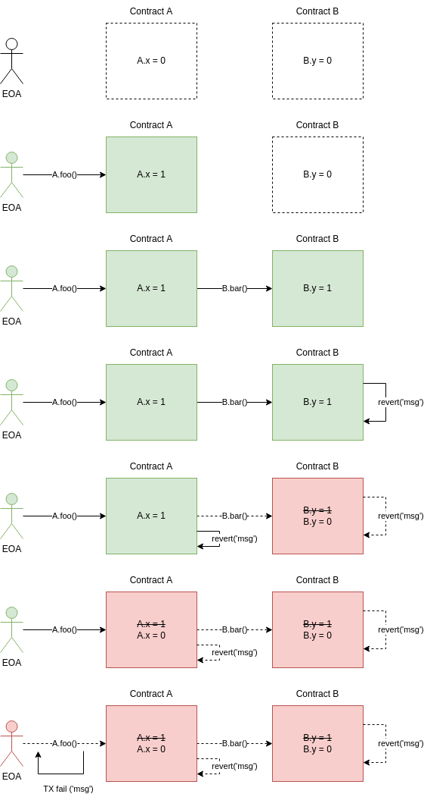

# Error Handling

- [📜 Example Code](./PooledExecute.sol)
- [🐞 Tests](../../test/PooledExecute.t.sol)

Any contract that interacts with external tokens or protocols should at least consider whether they need to gracefully handle errors when calling into them. In extreme cases, failure to do so could lead to scenarios where your contract becomes permanently frozen because some external contract it relies on reverts unexpectedly. Here we'll explore different ways to handle those errors and what we can do with them.

## Reverts and Call Contexts

First let's establish some foundational understanding of reverts by quickly going over how they're related to EVM call contexts.

Each time a contract makes a call to a function on another contract (and even to itself using `this.fn()` syntax), a new call context is entered. When a revert is encountered in that call, execution within that call context halts immediately and all state changes that occurred as a result of that call are undone (hence why it's called a "revert"). If no callers in the call chain intercept the revert, the revert will eventually bubble all the way upwards causing the entire transaction to fail.



### Internal Calls

It's worth pointing out that calls to `internal`/`private` functions as well as calls to `public` functions without using `this` redirection (e.g., `foo()` instead of `this.foo()`) are not true calls and will actually be implemented as `JUMP` instructions by the compiler, running similarly as if they were defined inside the calling function itself. This means that invoking them does not create a new call context, so reverting inside them has the same same effect as reverting inside their caller. There is no way to capture reverts a function throws inside of its own call context so these *are not* the types of function calls we're covering here.

## A Tale of Two Reverts

Typically contracts will explicitly revert using the `require()` or `revert()` built-in functions, or the `revert` keyword, which all issue a `REVERT` opcode. This is the recommended way of failing in a contract. As illustrated earlier, this ends execution of the current call context and returns control to the caller, signaling that the call failed with the provided revert data (e.g., the error string parameter to `require()` ).

But there is another, more insidious type of revert that can be raised with the `INVALID` opcode. You will rarely see people throw these intentionally. These types of reverts are sometimes employed by older versions of the solidity compiler when generating safeguarding code, such as checks for integer overflows. EVM violations, such as running out of gas or exceeding the call stack depth will also automatically throw this kind of revert. The critical difference between this type of revert and standard reverts (`REVERT` opcode) is that, with `INVALID`, all gas provided to the call will be consumed! This can have major implications when trying to design a resilient contract which we'll dig into [later](#adding-more-resiliency).

## Handling Reverts

As illustrated earlier, when making a vanilla call through solidity, the compiler will generate code that bubbles up any revert, meaning your function that made the failing call will immediately also revert in response.

Now let's look at ways to avoid this default behavior and eventually respond to a revert instead of just giving up 😛.

### `try` + `catch`

Solidity `0.6.0` introduced the `try`/`catch` contstruct which lets you handle call reverts with syntax familiar to other languages. Unlike visually similar languages, Solidity's `try`/`catch` only wraps *a single external call*, which immediately follows the `try` keyword.

```solidity
try someContract.someFunction(arg1, arg2) returns (uint256 someResult) {
    // Call succeeded. Work on someResult.
} catch (bytes memory revertData) {
    // Call failed. Work on revertData.
}
// Rest of function...
```

If you're used to reverts thrown with `require()` or `revert()` syntax, it may seem odd that `catch()` accepts a `bytes` for the `revertData` instead of a `string`. Indeed, this is the only parameter allowed for `catch()`. We'll dig into why and what this means [later](#inspecting-revert-data).

### Low-Level Calls

Prior to solidity `0.6.0`, low-level calls (or the equivalent assembly) were the only way to capture revert data and bypass the automatic bubbling up of reverts. Low-level calls use the `call()`, `staticcall()`, or `delegatecall()` methods on an `address` type, and we must ABI-encode the call data (which encodes the function to call and the parameters) ourselves. Instead of reverting if the call fails, you get back a tuple `(bool success, bytes returnOrRevertData)`, where the meaning of `returnOrRevertData` depends on whether the function succeeded or not.

```solidity
(bool success, bytes memory returnOrRevertData) = address(someContract).call(
    // Encode the call data (function on someContract to call + arguments)
    abi.encodeCall(someContract.someFunction, (arg1, arg2))
);
if (success) {
    // Process `returnOrRevertData` as encoded return data.
    uint256 someResult = abi.decode(returnOrRevertData, (uint256));
} else {
    // Process `returnOrRevertData` as encoded revert data.
}
```

This syntax obviously more long-winded and error-prone than `try`/`catch`, which can give you type-safety on the contract, arguments, and return value. But there are still extremely compelling reasons to use low-level calls as will be demonstrated [later](#adding-even-more-resiliency).

## Inspecting Revert Data

Now that we have interrupted the bubbling up of reverts and have access to the revert data, what can we do with it it?

You'll notice that, in all examples, the revert data is of type `bytes`. If you're used to throwing string reverts via `require()` or `revert()` syntax, you may wonder why this is not just of type `string`. The reason is that revert data (just like return data) can be any arbitrary sequence of bytes. Using the `revert` keyword (not function) will allow you to throw a custom ABI-encoded error type. In fact, when you throw a string revert, the revert data is not the string itself but actually ABI-encoded call data to a function with a signature of `Error(string)` (i.e., `0x08c379a00000000000000000000000000000000000000000000000000000000000000020...`):

```solidity
revert('hello')
// ^ is equivalent to:
error Error(string msg); // Declare custom error type
...
revert Error('hello'); // Throw custom error type
```

So, let's say we want to act differently if the contract reverts with the string `'foo'`. We can compare the hash (because this is often quicker than comparing bytes) of revert data to the hash of the ABI-encoded call to `Error(string)` with argument `'foo'`:

```solidity
try someContract.someFunction(arg1, arg2) returns (uint256 someResult) {
    ...
} catch (bytes memory revertData) {
    if (keccak256(revertData) == keccak256(abi.encodeWithSignature('Error(string)', ('foo')))) {
        // someContract.someFunction() failed with error string 'foo'
        ...
    }
}
```

If the revert error could be a more complex type, with distinct parameters that you want to act upon, you can check out [this guide on decoding it](../abi-decode-with-selector/).

## Manually Bubbling Up Reverts

We may find that we do not want to handle certain errors and instead want them to bubble up for the caller above us to handle. Often novice solidity devs will try to re-throw the revert data with `revert()` like:

```solidity
(bool success, bytes memory returnOrRevertData) = someContract.call(...);
if (!success) {
    // Try to bubble up the revert data to our caller by force-casting the
    // revert data to a string type because `revert()` only accepts a string.
    // This is wrong!!! 🪲
    revert(string(returnOrRevertData));
}
```

But remember that revert data can potentially be (and often is) an ABI-encoded `Error(string)` type, not a string at all! And since `revert()` ABI-encodes its argument as an `Error(string)` type, what actually ends up being bubbled up to the caller is a double-encoded `Error(string)` (an encoded error within an encoded error), which makes absolutely no sense. The correct way to bubble up a captured revert without altering the data is to drop into some simple assembly:

```solidity
(bool success, bytes memory returnOrRevertData) = someContract.call(...);
if (!success) {
    // Bubble up the revert data unmolested.
    assembly {
        revert(
            // Start of revert data bytes. The 0x20 offset is always the same.
            add(returnOrRevertData, 0x20),
            // Length of revert data.
            mload(returnOrRevertData)
        )
    }
}
```

## Adding More Resiliency

If your code is calling contracts that you either haven't vetted and/or if those contracts (or one that they call) can realistically encounter an `INVALID` opcode, then it might make sense to also add a gas limit to your call. Without it, the call may have the potential to consume all remaining gas. Specifying a gas limit limits the *maximum* amount of gas the call can consume, not the minimum. This way, you can be sure to still have enough gas remaining after the call returns to perform failover logic. You can apply a gas limit with both `try`/`catch` and low-level call constructs:

```solidity
// Restrict a try/catch call to 500k max gas.
try someContract.someFunction{gas: 500e3}(arg1, arg2) returns (uint256 someResult) {
    ...
} catch {
    ...
}
// Restrict a low-level call to 500k max gas.
(bool success, bytes memory returnOrRevertData) = address(someContract).call{gas: 500e3}(
    abi.encodeCall(someContract.someFunction, (arg1, arg2))
);
...
```

## Adding Even More Resiliency

There are some exotic edge cases that `try`/`catch` cannot handle because the revert will actually be thrown by code generated by the solidity compiler *as part of your function*. This can happen if:

- You're making a function call *that expects no return value* to an address that does not have any code in it.
    - This is because the compiler will generate code that first asserts that the call target has code in it.
    - Perhaps the contract at the call target never existed or self-destructed.
- The call returns data that cannot be abi-decoded as the expected return type.
    - For example, the function is supposed to return a `uint256` but actually returns less than 32 bytes of data.
    - Perhaps the contract is malicious or implements a token standard incorrectly.

To handle these more exotic cases gracefully, we may want to return to low-level calls because:
- The compiler will not generate the code check for the call target.
- We can perform validation on the abi-encoded return data before passing it into `abi.decode()` to avoid causing ourselves to revert the way `try`/`catch` would.

```solidity
(bool success, bytes memory returnOrRevertData) = address(someContract).call(
    abi.encodeCall(someContract.someFunction, (arg1, arg2))
);
if (success) {
    if (returnOrRevertData.length >= 32) {
        // Successful and returned a decodable uint256.
        uint256 someResult = abi.decode(returnOrRevertData, (uint256));
        ...
        return;
    }
}
// Either the call failed or the return data was too short to hold a uint256.
...
```

The default behavior of performing a call on an address without code is to *succeed* and return empty data. So if the call succeeds and is expected to return something, we can avoid checking if there is code at the contract by simply checking that the return data is non-zero length. However, be wary that if the call is expected to return nothing, there is no way to distinguish a successful call to a contract vs a call to an EOA, so you may want to manually check that the target address actually contains code in these cases.

## Who Really Needs This?

Sufficiently complex protocols that build on other protocols and tokens will usually need some kind of error handling in some part of their system (certain ERC20 tokens are notoriously non-compliant). So it is not uncommon to find these strategies in the wild. But depending on how critically you rely on external contracts and whether those contracts behave reliably, you may not need to be as resilient and it's rare you would need to worry about the contents of the revert data. In the majority of cases, simply doing nothing and allowing the revert to bubble up is actually the simpler and also perfectly acceptable approach.

## Runnable Example

The [included example](./PooledExecute.sol) is a contract that will execute an arbitrary call with value (set in the constructor) once enough users have contributed enough ETH via `join()`. If the call fails, everyone who contributed can withdraw their contribution via `withdraw()`. If we did not recover from a failed call, we would have to rely on some other mechanism to begin the withdrawal phase.

## References

This guide provides an embarrassingly condensed overview of Solidity revert and error constructs. For the full technical details, visit [the official docs](https://docs.soliditylang.org/en/v0.8.16/control-structures.html#error-handling-assert-require-revert-and-exceptions).
