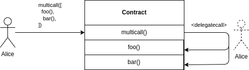

# Multicall
- [📜 Example Code](./TeamFarm.sol)
- [🐞 Tests](../../test/TeamFarm.t.sol)

*⚠️ Note that this is not referring to Maker's [`Multicall` utility contract](https://github.com/makerdao/multicall), which is used for performing arbitrary **read-only** calls, typically in an off-chain context.*

It's not uncommon for users interacting with a smart contract to occasionally need to call multiple functions to perform back-to-back operations to accomplish a single goal. However, most user wallets (EOAs) can only make a single top-level function call in a transaction. Many protocols will simply leave it up to users to make multiple transactions in these cases, or will create specialized top-level wrapper functions for commonly grouped operations (e.g., `wrapETHAndSwap()`).

The multicall pattern provides a simple and robust solution by creating a single top-level function (`multicall()`) that accepts an array of user-encoded calls to execute against its own contract.  This function loops through the call data array and performs a `delegatecall()` on itself with each one. This lets the user compose their own sequence of operations to be executed sequentially in a single transaction, without having to predefine the grouping of operations into the protocol.



## Case Study: A Shared Staking Wallet

Let's illustrate the effectiveness of this pattern with a simple contract, `TeamFarm`, that allows a group of people to deposit/withdraw ETH and ERC20s into the contract and stake/unstake those assets in some [ERC4626](https://ethereum.org/en/developers/docs/standards/tokens/erc-4626/) vault.

The contract has several top-level functions for managing the funds and stake held by the contract:


| function       | description       |
|-------------|---------|
| `deposit(token, tokenAmount)` | Deposits an ERC20 or ETH into the contract. |
| `withdraw(token, tokenAmount, receiver)` | Withdraw an ERC20 or ETH from the contract |
| `wrap(ethAmount)` | Wrap an amount of ETH held by the contract into WETH |
| `unwrap(wethAmount)` | Unwrap an amount of WETH held by the contract into ETH |
| `stake(vault, assets)` | Stake/deposit an amount of tokens (asets) held by this contract into an ERC4626 vault, creating shares from assets. |
| `unstake(vault, shares)` | Unstake/withdraw an amount of shares held by this contract from an ERC4626 vault, returning assets from shares. |

Members can perform these operations at any time, in any order. Say a member wanted to deposit X ETH to the contract, wrap it into WETH, then stake that WETH in a vault, they would need to make the series of calls:

1. `deposit(token=0, tokenAmount=X)` (the `0` address is an alias for native ETH)
2. `wrap(ethAmount=X)`
3. `stake(vault=WETH_VAULT_ADDRESS, assets=X)`

Normally, each of these calls would be their own transaction, incurring extra gas fees and there would be no strong guarantees that they will get executed atomically (all or nothing). Not great for UX or reliability.

## Adding Multicall

Now let's introduce a top-level `multicall()` function that takes an array of encoded call data (`bytes`), which we'll sequentially delegatecall on:

```solidity
function multicall(bytes[] calldata calls) external payable {
    for (uint256 i = 0; i < calls.length; ++i) {
        (bool s,) = address(this).delegatecall(calls[i]);
        require(s, 'multicall call failed');
    }
}
```

Thanks to `delegatecall` semantics, the address, `msg.value`, and `msg.sender`, and storage will be inherited by each call, and since the `delegatecall` target is ourselves (`address(this)`), the bytecode will be the same as well. This means each call gets executed as if the caller of `multicall()` called those functions directly. Both of these qualities are important because just about every function in the `TeamFarm` contract has restrictions on who can call them.

Using multicall, the `deposit()`, `wrap()`, and `stake()` operations/calls from the previous example can be executed in a single transaction by passing in the encoded call data for each of those calls into `multicall()`. As an example, calling the function in ethers.js might look like:

```ts
// Call `deposit()`, `wrap()`, and `stake()` all at once.
TEAM_FARM_CONTRACT.multicall([
    (await TEAM_FARM_CONTRACT.populateTransaction.deposit(ETH_AMOUNT)).data,
    (await TEAM_FARM_CONTRACT.populateTransaction.wrap(ETH_AMOUNT)).data,
    (await TEAM_FARM_CONTRACT.populateTransaction.stake(VAULT_ADDRESS, ETH_AMOUNT)).data,
], { value: ETH_AMOUNT });
```

## A Note On `payable` Functions
If you intend to support any `payable` functions as part of a multicall, the `multicall()` function istelf should be declared `payable`. Also, multicalled functions cannot be mixed with non-payable multicalled functions if any ETH is attached to `multicall()`. This is because `delegatecall` semantics will inherit the `msg.value` of the top-level `multicall()` call. Non-payable functions assert that `msg.value == 0`, so they will revert if `multicall()` is called with ETH attached. The easy way around this is to add `payable` to all functions that can be multi-called to bypass the check, but you should carefully evaluate what security implications this could introduce to those functions.

## In the Real World
- [Uniswap V3's router contract](https://github.com/Uniswap/v3-periphery/blob/main/contracts/SwapRouter.sol#L27) and [position manager contract](https://github.com/Uniswap/v3-periphery/blob/main/contracts/NonfungiblePositionManager.sol#L25) are most used implementations of the multicall pattern.
- UMA protocol has a [`Multicaller`](https://github.com/UMAprotocol/protocol/blob/master/packages/core/contracts/common/implementation/MultiCaller.sol) contract mixin used by `HubPool` and `SpokePool` contracts.
- PartyDAO's [Party Protocol](https://github.com/PartyDAO/party-protocol) uses the multicall pattern on their [global configurations contract](https://github.com/PartyDAO/party-protocol/blob/main/contracts/globals/Globals.sol) so they can update multiple configuration parameters at once.
