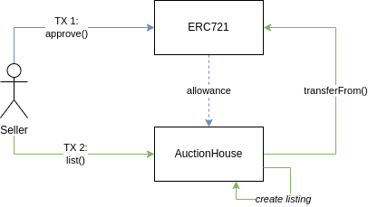
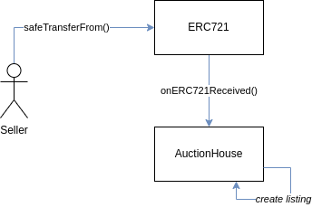

# NFT Receive Hooks

- [📜 Example Code](./NftReceiveHooksAuction.sol)
- [🐞 Tests](../../test/NftReceiveHooksAuction.t.sol)

ERC721 (and ERC1155), the token standards that define the most common NFT contracts on EVM chains, draw heavy inspiration from ERC20. This is apparent in its allowance mechanism. Users call either `approve()` or `setApprovalForAll()` to grant another address the ability to transfer an NFT token from themselves in a future transaction/call. If the interaction that performs the NFT transfer is sent by another user (not the owner), this makes perfect sense. But if the transaction is actually sent by the token owner, there is no need to use allowances at all!

## `onERC721Received()`
The [ERC721 standard](https://eips.ethereum.org/EIPS/eip-721) defines an `onERC721Received()` handler function that lets the recipient take execution control during a call to `safeTransferFrom()`. Additionally, an arbitrary `bytes` data parameter can also be passed along through the transfer call into the handler. This data parameter is usually decoded by the handler and provides application-specific context on the purpose of the transfer.

## Case Study: Custodial Auction Listing

To demonstrate the advantages of the pattern, let's see at what it looks like with a conventional, allowance based approach for a fictional, custodial NFT auction protocol.



1. Seller makes a transaction (1) calling `nft.approve(auctionHouse, tokenId)` for the token being listed, granting `auctionHouse` an allowance to transfer `tokenId` on their behalf.
2. Seller makes another transaction (2) calling `auctionHouse.list(nft, tokenId, listOptions)`.
    1. `auctionHouse` calls `nft.transferFrom(msg.sender, address(this), tokenId)` to take custody of the token and starts an auction based on `listOptions` config.

Compare that approach to a much simpler one using the receive hook.



1. Seller makes a *single* transaction calling `nft.safeTransferFrom(seller, auctionHouse, tokenId, abi.encode(listOptions))`.
    1. The NFT contract calls `auctionHouse.onERC721Recevied(..., data)`.
        1. `auctionHouse` decodes `data` (`listOptions = abi.decode(data, ListOptions)`) and starts an auction based on the decoded config. 

So, in this case, using transfer hooks is one less transaction for the user 😎.

## Anatomy of the Hook
`onERC721Received()` is declared as as:

```solidity
function onERC721Received(address operator, address from, uint256 tokenId, bytes data) external returns(bytes4);
```

- This function called on the recipient of the token.
- This call is made *after* the token is transferred.
- `operator` is the address that called `safeTransferFrom()`, which in this pattern will always be `tx.origin` (owner).
- `from` is the original owner of the token, which in this pattern will also be `tx.origin`.
- `msg.sender` will be the ERC721 token contract.
    - Anyone can call this function, so depending on your product's expectations, you may want to enforce that the `msg.sender` is a known NFT contract.
- `data` is *any* arbitrary data the *caller* of `safeTransferFrom()` passes in. Do not expect it to always be well-formed because of this.
- This handler is not `payable`, so if you also need to collect ETH from the user (unlikely) in the same transaction, you may need to have the user set up a WETH allowance in advance.
- The return value must be `onERC721Received.selector` (`0x150b7a02`).

## ERC1155
[ERC1155 tokens](https://eips.ethereum.org/EIPS/eip-1155#erc-1155-token-receiver) also support a similar mechanism through its `onERC1155Received()` and `onERC1155BatchReceived()` hooks, with nearly identical semantics.

## Real World Usage
- The official [Mooncats wrapper](https://etherscan.io/address/0xc3f733ca98e0dad0386979eb96fb1722a1a05e69#code) uses `onERC721Received()` to turn unofficial wrapped mooncats into official wrapped mooncats when someone transfers them to the contract.
- The ERC721 orders feature of the [0x Exhange Protocol](https://github.com/0xProject/protocol/blob/development/contracts/zero-ex/contracts/src/features/nft_orders/ERC721OrdersFeature.sol#L462) accepts a complementary NFT buy order encoded in the `data` param to perform a swap at the same time as the transfer. 

## The Demo
The [included demo](./NftReceiveHooksAuction.sol) is a basic, no-frills NFT auction house contract that uses `onERC721Received()` to start an auction in a single transaction.