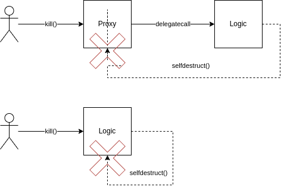

# `onlyDelegateCall` / `noDelegateCall`

- [📜 Example Code](./DelegateCallModifiers.sol)
- [🐞 Tests](../../test/DelegateCallModifiers.t.sol)

In [proxy](../basic-proxies/) architectures, a thin proxy contract uses its fallback function to forward all calls it receives to a "logic" contract. It does so using a low-level `delegatecall()` to the logic contract. A delegatecall executes another contract's code but inside the same execution context as the caller. This means call properties such as `msg.sender`, `msg.value`, and `address(this)`, as well as all storage, are inherited from the contract issuing the `delegatecall()`. This allows a proxy contract to run bytecode of another contract is if it were its own.


```
           call     ┌────────────────────┐              ┌────────────────────┐
       Proxy.foo()  │                    │              │                    │
User ───────────────►   Proxy Contract   │              │   Logic Contract   │
                    │                    │              │                    │
 ▲                  ├────────────────────┤ delegatecall └────────────────────┤
 │                  │                    ├──────────────►                    │
 │    foo() result  │     fallback()     │              │       foo()        │
 └──────────────────┤                    ◄──────────────┤                    │
                    ├────────────────────┐              └─────────┬──────────┘
                    │                    │                        │
                    │   storage/state    │                        │
                    │                    ├─ ── ── ── ── ── ── ── ─┘
                    └────────────────────┘       (shared state)
```

## Logic Contracts Are Still Contracts
In proxy setups, users should interact directly with the proxy contract and never the logic contract. However, logic contracts are often completely valid and fully functional contracts on their own.  It's easy to forget that there is usually nothing actually stopping a user from directly interacting with said contracts. In most cases, this has little impact on the rest of the protocol since logic contracts aren't typically permissioned within systems. But there are some scenarios where you will want to either prevent a logic contract from being called on directly or even require that a logic contract be called on directly. Luckily, there's a pretty cheap and easy way to satisfy both.

## `onlyDelegateCall`
In 2017 the [Parity multisig wallet was infamously hacked](https://blog.openzeppelin.com/parity-wallet-hack-reloaded/), with ~$150M worth of ETH becoming trapped forever across many instances of a now worthless smart wallet. Individual instances of the wallet did something akin to proxy architectures by delegatecalling into a shared library contract for some of its logic. This library contract had an initialize function that was intended to be (delegate) called during construction of a new wallet. This would populate some state, notably the wallet's owner, in the new wallet and mark it as initialized so it couldn't be initialized again. However, the developers didn't consider someone calling the initialize function *directly* on the library/logic contract. Since no one had done it before, the first person to do so could initialize themselves as the owner within the logic contract's context. By itself this would amount to very little but, critically, the logic contract also had a `kill()` function that, if called by the owner, would `selfdestruct` the contract.

When a `selfdestruct()` is encountered, it deletes the contract bytecode at `address(this)`. If `kill()` is called through a wallet instance, it would only destroy the wallet. But when called directly on the logic contract, it destroys the logic contract. With bytecode no longer existing at the logic contract address that wallets pointed to, any `delegatecall()` to the logic contract would either do nothing or ultimately result in a failure.



The lesson from this is that if your logic contract can self-destruct OR if your logic contract can delegatecall to an arbitrary contract address (which could thereby self-destruct), you should strongly consider limiting the functions on that contract to only being called in a delegatecall context. Modern solidity (Parity did not have this luxury at the time) makes it quite easy to create a modifier, `onlyDelegateCall`, that restricts functions in exactly this way:

```solidity
abstract contract DelegateCallModifiers {
    // The true address of this contract. Where the bytecode lives.
    address immutable public DEPLOYED_ADDRESS;

    constructor() {
        // Store the deployed address of this contract in an immutable,
        // which maintains the same value across delegatecalls.
        DEPLOYED_ADDRESS = address(this);
    }

    // The address of the current executing contract MUST NOT match the
    // deployed address of this logic contract.
    modifier onlyDelegateCall() {
        require(address(this) != DEPLOYED_ADDRESS, 'must be a delegatecall');
        _;
    }
}
```

This example is of a base contract that you would inherit from in your logic contract and apply the modifier to risky functions. It works because:
- There is no way to delegatecall into a constructor so `address(this)` inside the constructor is always the deployed address of the currrent contract.
- Immutable types do not live in a contract's usual storage, but instead becomes a part of its deployed bytecode, so it will still be accessible even inside a delegatecall.
- Since `address(this)` is inherited from the contract that issued the `delegatecall()` and the immutable-stored `DEPLOYED_ADDRESS` stays with the bytecode being executed, inside of a delegatecall they will differ.

## `noDelegateCall`
Some protocols have tried to apply restrictive licenses that prohibit forking their code. But people have cunningly tried to circumvent these licenses by using `delegatecall()`, which could simply reuse the already deployed instance of existing contracts under the guise of another product. Both V1 and V2 of Uniswap have been forked so frequently to the point of becoming a meme but why don't we see the same trend with Uniswap V3? Uniswap V3 [went a step further](https://github.com/Uniswap/v3-core/pull/327#issuecomment-813462722) by outright preventing delegatecalls into many of their core contracts.

To create a `noDelegateCall` modifier, which is the inverse of the `onlyDelegateCall` modifier, we just flip the inequality. Now we *want* our execution context's address to match our logic contract's deployed address. If any other contract tries to delegatecall into our logic contract, `address(this)` will not match `DEPLOYED_ADDRESS`. Easy!

```solidity
// The address of the current executing contract MUST match the
// deployed address of this logic contract.
modifier noDelegateCall() {
    require(address(this) == DEPLOYED_ADDRESS, 'must not be delegatecall');
    _;
}
```

## The Example Code
[The example project](./DelegateCallModifiers.sol) that accompanies this guide implements both modifiers to be used inside a basic proxy architecture. We have two versions of a logic contract, `Logic` and `SafeLogic`, to demonstrate a potential use-case for each modifier. The `Logic` contract exposes two functions, each with vulnerabilities:

- `die()`, which is intended to self-destruct the *proxy* contract instance when called by the initialized owner. However, like in the Parity hack, the `Logic` contract can be initialized directly which can allow someone to call `die()` directly on it, bricking every proxy contract that uses it.
- `skim()`, which is a convenience function deisgned to allow anyone to take any ETH mistakenly sent to the logic contract. However, there is nothing stopping this function from being called through a proxy instance, which would mean all proxies that use this logic contract can have ETH taken out of them at any time.

The `SafeLogic` contract re-implements and corrects the vulnerable functions in `Logic` by applying an `onlyDelegateCall` modifier to `die()` and a `noDelegateCall` modifier to `skim()`. For examples on how to exploit the vulnerable functions, see the [tests](../../test/DelegateCallModifiers.t.sol).