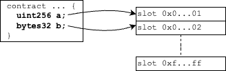

# Packing Storage

- [📜 Example Code](./PackedStoragePayouts.sol)
- [🐞 Tests](../../test/PackedStoragePayouts.t.sol)

Contract storage in the EVM is built around the concept of "slots," where each slot is 32 bytes wide and can be indexed by any 256-bit number. In the simple case, the compiler will assign storage variables to successive slots as you declare them in your contracts.



As a single operation, reading and writing to a storage slot is probably the most expensive thing your contract does regularly, with a single read costing up to 2,100 gas and single write costing up to 20,000 gas (on mainnet). Non-trivial contracts will usually need to read from and write to many storage variables in a single transaction, meaning the costs can quickly add up.

## Manual Slot Packing

One way to reduce the impact of accessing multiple storage variables is to try to fit more than one variable into a single slot. If you have two (or more) storage variables that have a combined size of up to 32 bytes, you can store them both in a single slot using bitwise operations, potentially cutting the number of reads and writes in half (or more).

```solidity
// Packed slot holding a uint64 and an address.
bytes32 _packedUint64Address;

function readPackedValues() public view
    returns (uint64 u64, address a160)
{
    // read the slot once
    bytes32 packed = _packedUint64Address;
    // uint64 is in the lower 64 bits
    u64 = uint64(packed & (2**64-1));
    // address is in next 160 bits
    a160 = address(uint160((packed >> 64) & (2**160-1)));
}

// Similar logic for writing...
```

But you don't need to do this!

## Automatic Slot Packing
The above syntax is pretty unsightly. Fortunately the solidity compiler will do this for you, out of the box, for free!

The compiler will attempt to pack any storage variables that are delcared **adjacent** to each other, so long as they can fit inside 32 bytes. If they cannot fit in the same slot, the next slot is used and packing starts anew from there. Because of this process, each storage variable innately has a "slot" (0 - 2^32-1) and byte "offset" (0-31) property associated with it. When you write solidity that accesses a storage variable, the compiler will generate code that performs the bitwise operations to isolate the variable from the slot, just like when we did it manually but without having to think about it.

### What Types Pack?

All primitive types < 32 bytes that are declared *adjacent*, even across inherited contracts, can pack with each other, this includes:

- Integers:
    - `uint8`-`uint248`
    - `int8`-`int248`
- Fixed-width bytes:
  - `bytes1`-`bytes31`
- `bool`s
- `enum`s

Delcaring any non-primitive type (structs, arrays, mappings, etc) of storage variable will interrupt the packing allocation (S) and will assign that variable to a new slot (S+1), even if the current slot is not fullly utilized. Non-primitive types cannot be packed with adjacent variables so the following variable will also start on a new slot (S+2).

Certain types will also pack fields/values *within* themselves, but not with variables delcared adjacent to them. This includes `struct`s, fixed-width arrays, and short (<32 length) `bytes`/`string`s.

Take, for example, the following contracts:
```solidity
contract ContractA {
    bool foo;
}

contract ContractB is ContractA {
    struct MyStruct {
        uint32 bar;
        uint32 zing;
    }
    address who;
    MyStruct myStruct;
    uint16[3] things;
}
```

...will result in the following storage layout:

| storage variable | slot | offset | length |
|------------------|------|--------|--------|
| `ContractA.foo`    | 0    | 0      | 1      |
| `ContractB.who`    | 0    | 1      | 20      |
| `ContractB.myStruct.bar` | 1 | 0 | 4 |
| `ContractB.myStruct.zing` | 1 | 4 | 4 |
| `ContractB.things[0]` | 2 | 0 | 2 |
| `ContractB.things[1]` | 2 | 2 | 2 |
| `ContractB.things[2]` | 2 | 4 | 2 |

### Inspecting Assigned Slots And Offsets

Most people won't need to, but you can uncover the slot and offset values associated with a storage variable for use in your code using assembly:
```solidity
uint64 _u64;
address _a160;

// Returns (0, 8)
function getAddressSlotAndOffset() external pure
    returns (uint256 slot, uint8 offset)
{
    assembly {
        slot := _a160.slot     // 0
        offset := _a160.offset // 8
    }
}
```

The solc compiler (and therefore foundry, hardhat, truffle, etc) can also [produce a storage layout map](https://docs.soliditylang.org/en/v0.8.16/using-the-compiler.html#input-description) as part of its build artifact, which will output the assigned slot, offset, and length of each storage variable declared in your contract(s). This can be extremely useful for getting your layouts right before deploying.

## Tips

### Co-location
A good rule-of-thumb for getting the most benefit out of storage packing is to declare variables that are frequently read or written together next to each other, so the compiler is hinted to try to fit them into the same slot.

### Smaller Types
Choose types that realistically match the range of values they will hold. For example, if you are tracking an absolute, real quantity of ETH, USDC, etc, the `uint256` type is probably wasting bits you will never need and you could probably get away with a `uint128` or even `uint96`. For timestamps, a `uint40` can represent 34,000+ years in seconds, which is probably more than enough for your protocol 😉. But, in all cases, be wary of overflows when downcasting.

### EIP-2929
[EIP-2929](https://eips.ethereum.org/EIPS/eip-2929) introduced a concept of "warm" and "cold" storage access. In an oversimplified nutshell, the first time a storage slot is accessed, a 2,100 (at least) gas fee is incurred, but each read thereafter only costs 100. This reduces the impact of repeated access to a storage slot. So even if you do not necessarily read two variables at the same place in your code, so long as they're each read in the same transaction, it may be worth it to pack them together because reading one will discount the read on the other. Note that this behavior only applies to chains that have implemented EIP-2929.

## Working Example

The [provided example](./PackedStoragePayouts.sol) demonstrates two implementations (to illustrate gas difference) of a contract that distributes ETH on a vesting schedule. Both track 4 integer storage variables per payout created through `vest()`:

- `cliff`: When payouts begin.
- `period`: How long the payouts will be made for.
- `totalAmount`:  The total amount of ETH that will be paid out.
- `vestedAmount`: How much ETH has been claimed.

The naive implementation (`NaivePayouts`) declares these variables all as `uint256`s, which is a typical approach new developers take. This means each call to `claim()` reads from 4 slots. But the packed version (`PackedPayouts`) carefully chooses the types and semantics of each variable to make sure they all sum up to exactly 32 bytes. This allows `claim()` to do the same thing with only a single slot read.

You can run the tests with `forge test --gas-report` to get an idea of the gas used by each implementation. The packed solution is 38% cheaper (21646 vs 33232) on `claim()` and 48% cheaper 😳 (47992 vs 93108) on `vest()`. Not bad!
