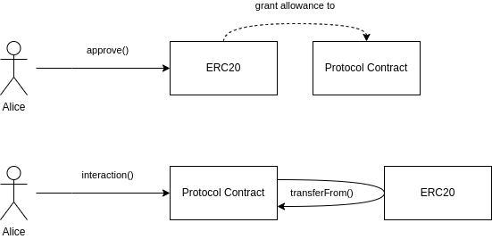
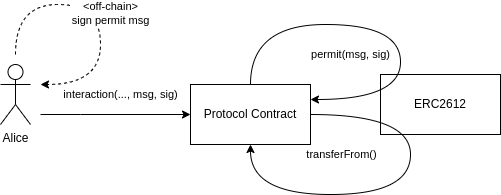
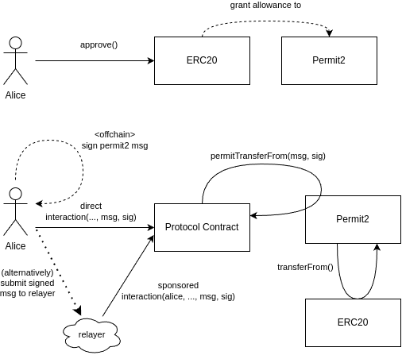

# Permit2
- [📜 Example Code](./Permit2Vault.sol)
- [🐞 Tests](../../test/Permit2Vault.t.sol)

When a protocol needs to move tokens held by a user, the first step is usually to have the user to set an allowance on the [ERC20](https://eips.ethereum.org/EIPS/eip-20) token for their contract(s). This is the natural approach prescribed by the ERC20 standard and, despite its UX and security drawbacks, has rarely been challenged. [EIP-2612](https://eips.ethereum.org/EIPS/eip-2612) was an improvement on the ERC20 standard that addressed those drawbacks but could only apply to new tokens. [Permit2](https://github.com/Uniswap/permit2) leverages both models to extend the UX and security advantages of EIP-2612 to also cover vanilla ERC20 tokens!

To set the stage for illustrating how revolutionary Permit2 can be, let's very quickly look at the preceding solutions in a common scenario where a protocol needs to move tokens held by our perpetual heroine, Alice.

## Standard Allowance Model

First, the traditional allowance-based approach, which typically goes like this:


1. Alice calls `approve()` on an ERC20 to grant a spending allowance to a contract.
2. Alice calls an interaction function on the contract, which in turn calls `transferFrom()` on the ERC20 token contract, moving her tokens.

Obviously this model works (it's ubiquitous) and can ultimately be quite flexible since the protocol will usually wind up with uninterrupted, long-term access to the user's tokens. But it suffers from two well-known, real-world issues:

- **Bad UX**: Users must approve *every* new protocol on each token they intend to use with it, and this is almost always a separate transaction. 💸
- **Bad security**: Applications often ask for unlimited allowances to avoid having to repeat the above UX issue. This means that if the protocol ever gets exploited, every user's token that they've approved the protocol to spend can potentially be taken right out of their wallets. 🙈

## Permit (EIP-2612) Model
Next, let's look at the approach enabled by the EIP-2612 extension to ERC20, which typically goes like:



1. Alice signs an off-chain "permit" message, signaling that she wishes to grant a contract an allowance to spend a (EIP-2612) token.
2. Alice submits the signed message as part of her interaction with said contract.
3. The contract calls `permit()` on the token, which consumes the permit message and signature, granting the contract an allowance.
4. The contract now has an allowance so it can call `transferFrom()` on the token, moving tokens held by Alice.

This solves both issues from the conventional, vanilla ERC20 approach:
- The user never has to submit a separate `approve()` transaction.
- There is no longer a necessary evil of dangling allowances since permit messages grant an instantaneous allowance that is often spent right away. These messages can also choose a more reasonable allowance amount and, more importantly, an expiration time on when the permit message can be consumed.

But the tragic reality is that most times this approach is not an option. Since EIP-2612 is an extension of the ERC20 standard, this functionality is only possible on new (or upgradeable) tokens. So there are very few major tokens in the wild where this pattern actually works.

*(Side note: EIP-2612 permits have been explored in more detail in a separate guide [here](../erc20-permit)!)*

## Permit2 Model

Finally, let's dive into the Permit2 approach, which echoes elements from both preceding solutions:



1. Alice calls `approve()` on an ERC20 to grant an infinite allowance to the canonical Permit2 contract.
2. Alice signs an off-chain "permit2" message that signals that the protocol contract is allowed to *transfer* tokens on her behalf.
3. Alice calls an interaction function on the protocol contract, passing in the signed permit2 message as a parameter.
4. The protocol contract calls `permitTransferFrom()` on the Permit2 contract, which in turn uses its allowance (granted in 1.) to call `transferFrom()` on the ERC20 contract, moving the tokens held by Alice.

It might seem like a regression to require the user to grant an explicit allowance first. But rather than granting it to the protocol directly, the user will instead grant it to the canonical Permit2 contract. This means that if the user has already done this before, say to interact with another protocol that integrated Permit2, every other protocol can skip that step! 🎉

Instead of directly calling `transferFrom()` on the ERC20 token to perform a transfer, a protocol will call `permitTransferFrom()` on the canonical Permit2 contract. Permit2 sits between the protocol and the ERC20 token, tracking and validating permit2 messages, then ultimately using its allowance to perform the `transferFrom()` call directly on the ERC20. This indirection is what allows Permit2 to extend EIP-2612-like benefits to every existing ERC20 token! 🎉

Also, like EIP-2612 permit messages, permit2 messages expire to limit the the attack window of an exploit. 

## Integrating Permit2

For a frontend integrating Permit2, it will need to collect a user signature that will be passed into the transaction. The Permit2 message struct (`PermitTransferFrom`) signed by these signatures must comply with the [EIP-712](https://eips.ethereum.org/EIPS/eip-712) standard (for which [we have a general guide](../eip712-signed-messages/)), using the Permit2 domain and type hashes defined [here](https://github.com/Uniswap/permit2/blob/main/src/EIP712.sol) and [here](https://github.com/Uniswap/permit2/blob/main/src/libraries/PermitHash.sol). Be aware that the `spender` field for the EIP-712 Permit2 object needs to be set to the contract address that will be consuming it.

The smart contract integration is actually fairly easy! Any function that needs to move tokens held by a user just needs to accept any unknown permit message details and the corresponding EIP-712 user signature. To actually move the tokens, we will call `permitTransferFrom()` on the canonical Permit2 contract. That function is declared as:

```solidity
    function permitTransferFrom(
        PermitTransferFrom calldata permit,
        SignatureTransferDetails calldata transferDetails,
        address owner,
        bytes calldata signature
    ) external;
```

The parameters for this function are:
- `permit` - The permit2 message details, with the following fields:
    - `permitted` - A `TokenPermissions` struct with the following fields:
        - `token` - Address of the token to be transferred.
        - `amount` - *Maximum* amount that can be transferred when consuming this permit.
    - `nonce` - A unique number, chosen by our app, to identify this permit. Once a permit is consumed, any other permit using that nonce will be invalid.
    - `deadline` - The latest possible block timestamp for when this permit is valid.
- `transferDetails` - A struct containing the transfer recipient and transfer amount, which can be less than the amount the user signed for.
-  `owner` - Who signed the permit and also holds the tokens. Often, in simple use-cases where the caller and the user are one and the same, this should be set to the caller (`msg.sender`). But in more exotic integrations, [you may need more sophisticated checks](https://docs.uniswap.org/contracts/permit2/reference/signature-transfer#security-considerations).
- `signature` - The corresponding EIP-712 signature for the permit2 message, signed by `owner`. If the recovered address from signature verification does not match `owner`, the call will fail.

> 🛈 Note that the `PermitTransferFrom` struct does not include the `spender` field found in the [EIP-712 typehash definition for the permit message](https://github.com/Uniswap/permit2/blob/main/src/libraries/PermitHash.sol#L21). It will be populated with our contract's address (the direct caller of `permitTransferFrom()`) during processing. This is why the `spender` field of the EIP-712 object the user signs must be the address of this contract.

### Advanced Integrations
This guide covers the basic functionality offered by Permit2 but there's more you can do with it!
- [Custom Witness Data](https://docs.uniswap.org/contracts/permit2/reference/signature-transfer#single-permitwitnesstransferfrom) - You can append custom data to the permit2 message, which means the Permit2 signature validation will extend to that data as well.
- [Batch Transfers](https://docs.uniswap.org/contracts/permit2/reference/signature-transfer#batched-permittransferfrom) - A batched permit2 message for performing multiple transfers, secured by a single signature.
- [Smart Nonces](https://docs.uniswap.org/contracts/permit2/reference/signature-transfer#nonce-schema) - Under the hood, nonces are actually written as bit fields in an storage slot indexed by the upper 248 bits. You can save a signficant amount of gas by carefully choosing nonce values that reuse storage slots.
- [Callback signatures](https://github.com/Uniswap/permit2/blob/main/src/libraries/SignatureVerification.sol#L43) - Permit2 supports [EIP-1271](https://eips.ethereum.org/EIPS/eip-1271) callback signatures, which allow smart contracts to also sign permit2 messages.
- [Permit2 Allowances](https://docs.uniswap.org/contracts/permit2/reference/allowance-transfer) - For protocols that need more flexibility, Permit2 supports a more conventional allowance model that gets the added benefit of expiration times. 

## The Demo

The provided [example code](./Permit2Vault.sol) is a simple vault that users can deposit ERC20 tokens into using Permit2, which they can later withdraw. Because it's multi-user, it needs to initiate the transfer in order to reliably credit which account owns which balance. Normally this requires granting an allowance to the vault contract and then having the vault perform the `transferFrom()` on the token itself, but Permit2 allows us to skip that hassle!

The [tests](../../test/Permit2Vault.t.sol) deploy a local, bytecode fork of the mainnet Permit2 contract  to test an instance of the vault against. The EIP-712 hashing and signature generation is written in solidity/foundry as well, but should normally be performed off-chain at the frontend/backend level in your language of choice.

## Resources
- [Permit2 Announcement](https://uniswap.org/blog/permit2-and-universal-router) - The canonical Permit2 address can also be found here.
- [Permit2 Repo](https://github.com/Uniswap/permit2) - Permit2 Smart contracts
- [Permit2 `SignatureTransfer` Docs](https://docs.uniswap.org/contracts/permit2/reference/signature-transfer) - Official Permit2 docs provided by Uniswap.
