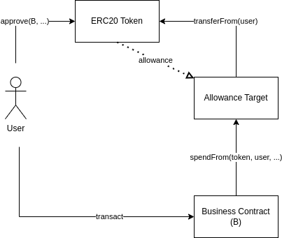

# Separate Allowance Targets

- [📜 Example Code](./AllowanceTarget.sol)
- [🐞 Tests](../../test/AllowanceTarget.t.sol)

Usually protocols that need to spend a user's ERC20 tokens will ask the user to set an allowance (via `ERC20.approve()`) on their primary business logic contract which, afterwards, can directly call `transferFrom()` on the ERC20 contract to pull tokens from the user.


However, if a new version of the logic contract gets deployed, existing users will have to set all new allowances on this contract, and possibly revoke allowances set on the old contract. If you're iterating on your contracts at a regular pace, this can introduce a lot of UX friction.

Rather than having users set allowances on the your business contracts, you can instead deploy a separate, single-purpose "allowance target" contract that users set allowances to. The allowance target exposes functions that can perform the `transferFrom()` on behalf of *authorized* callers, which would be your business contracts.



The allowance target contract persists across protocol upgrades and new authorities can be added as the protocol evolves, so new versions of the protocol contracts can immediately use existing token allowances. Authorized callers can also be removed, which is a convenient way of safely decommissioning and disarming deprecated components of the protocol.

## Designing the `AllowanceTarget` Contract

The `AllowanceTarget` just needs to do a few things:
- Expose a `spendFrom()` function that, in turn, calls `transferFrom()` for a given token, user, and amount.
- Keep track of which addresses are allowed to call `spendFrom()`.
- Allow an admin to add new authorized addresses.

So first we define two state variables -- one to track the admin and another to track whether an address is allowed to call `spendFrom():

```solidity
address public admin;
mapping (address => bool) public authorized;
```

We initialize the admin in the constructor. We also need to define a function that lets the admin authorize (and de-authorize) addresses from calling `spendFrom()`.

```solidity
constructor(address admin_) {
    admin = admin_;
}

function setAuthority(address authority, bool enabled) external {
    require(msg.sender == admin, 'only admin can call this');
    authorized[authority] = enabled;
}
```

Finally, we expose the `spendFrom()` function, which performs the `transferFrom()` at the behest of an authority (your business contract).

```solidity
function spendFrom(IERC20 token, address from, address to, uint256 value)
    external
{
    require(authorized[msg.sender], 'only authorized');
    token.transferFrom(from, to, value);
}
```

💡 *Note that on ethereum mainnet, you will probably want to call `transferFrom()` in a manner that [works with non-compliant ERC20 tokens](../erc20-compatibility/).*

## The Demo
The included [demo](./AllowanceTarget.sol) has a fully working `AllowanceTarget` contract that also supports non-compliant ERC20 tokens. The [tests](../../test/AllowanceTarget.sol) demonstrate usage from a user and business contract perspective.

## Real World Usage
- One of the early production incarnations of this pattern was with the 0x v1 (and up to v3) exchange protocol, which had standalone ["asset proxy" contracts](https://etherscan.io/address/0xf740b67da229f2f10bcbd38a7979992fcc71b8eb#code#F17#L1) that were the target of token approvals and performed the transfers on behalf of the protocol during settlement. These asset proxies carried over across successive versions of the protocol
- Opensea's Seaport protocol has a concept of ["conduits"](https://github.com/ProjectOpenSea/seaport/blob/main/contracts/conduit/Conduit.sol), which are also marketplace-specific, standalone contracts that users set approvals to and the protocol goes through to perform the the transfer during settlement.

