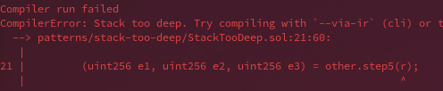

# Stack Too Deep Workarounds
- [📜 Example Code](./StackTooDeep.sol)
- [🐞 Tests](../../test/StackTooDeep.t.sol)

The EVM is stack-based, which means most EVM instructions will consume their arguments from the top of the stack, which is a small, distinct kind of memory for working data (usually local variables).

```
    ┌───────────────────┐
n+2 │        b          ├─────────┐                    ┌───────────────────┐
    ├───────────────────┤         ├──► ADD(a,b)───────►│       a + b       │ n+1
n+1 │        a          ├─────────┘                    ├───────────────────┤
    ├───────────────────┤                              │        ...        │  n
 n  │        ...        │                              └───────────────────┘
    └───────────────────┘                                    le stack
           le stack
```

In solidity, by default, most function arguments and variables will also live on the stack, getting shuffled around as needed during execution. In total, the stack can hold 1024 32-byte values but only the top 32 slots are directly accessible at any time. So, in complex functions, you can easily run into situations where compilation will fail because the compiler encounters a variable that falls outside of this accessible region of the stack.



Let's go over the common solutions to this predicament.

## Compile With IR Codegen

Newer versions of `solc` (the solidity compiler) will suggest using the `--via-ir` flag to first compile solidity into [yul](https://docs.soliditylang.org/en/v0.8.17/yul.html) before optimizaion. The IR codegen path is capable of autonomously moving stack variables into `memory` (which is large and freely addressable) to get around stack size limits. Both [Foundry](https://book.getfoundry.sh/config/) and [Hardhat](https://hardhat.org/hardhat-runner/docs/guides/compile-contracts) are able to pass in this flag.

This solution requires very little effort on your end but may not be able to address every situation and can come at the expense of increased compilation times and any risks associated with a less mature codgen pipeline. Taking one of the upcoming approaches might also result in clearer, more human verifiable code anyway, *so don't stop here*!

## Block Scoping

In complex functions, chances are that not every declared variable is actually needed throughout the entirety of the function body. By practicing the good code hygiene of keeping variable declarations close to the code that actually uses them, you can often identify variables that have a limited lifespan within a function. You can then enclose those delcarations and operations inside scoping blocks (`{ ... }`) so the compiler can discard those variables earlier. Any variables that need to persist outside that logic should be declared outside the scoping blocks.

Consider the example:

```solidity
uint16 feeRateBps = manager.getFeeRate();
uint256 exchangeRate = getExchangeRate(fromToken, toToken);
if (exchangeRate == 0) revert ZeroExchangeRateError();

uint256 toAmount = (fromAmount * exchangeRate) / 1e18;
uint256 feeAmount = (toAmount * feeRateBps) / 1e4;
toAmount -= feeAmount;

fees[toToken][toAmount] += feeAmount;
balances[fromToken][user] -= fromAmount;
balances[toToken][user] += toAmount;

return toAmount;
```

4 local variables are pushed onto the stack by the end of this code block. But with some slight rearranging and block scoping, we can wind up with just 1 (`toAmount`):

```solidity
uint256 toAmount;
{
   uint256 exchangeRate = getExchangeRate(fromToken, toToken);
   if (exchangeRate == 0) revert ZeroExchangeRateError();
   toAmount = (fromAmount * exchangeRate) / 1e18;
   {
      uint16 feeRateBps = manager.getFeeRate();
      uint256 feeAmount = (toAmount * feeRateBps) / 1e4;
      toAmount -= feeAmount;
      fees[toToken][toAmount] += feeAmount;
   }
}

balances[fromToken][user] -= fromAmount;
balances[toToken][user] += toAmount;

return toAmount;
```

This new version is also easier to verify because you know exactly for which operations a local variable is used and when you can safely forget about it. For this reason alone, block scoping should be used more often, even if you aren't running into stack issues!

## Using Memory Structs

You can manually declare variables that live in `memory` instead of the stack by defining them in a `struct` type. When used this way, the only value that needs to be stored on the stack is a pointer to the `memory` offset of the struct, so several variables could effectively be collapsed into a single stack entry.

```solidity
struct ExchangeVars {
   uint16 feeRateBps;
   uint256 exchangeRate;
   uint256 toAmount;
   uint256 feeAmount;
}

...

ExchangeVars memory vars;
vars.feeRateBps = manager.getFeeRate
vars.exchangeRate = getExchangeRate(fromToken, toToken);
... // etc
```

But where this approach really makes the most sense, because it provides instant readability and maintainability wins, is in the case of functions that accept or return many arguments. Functions that accept or return many arguments are, coincidentally, a common place to run into stack-too-deep issues because each argument occupies a stack space.

To illustrate, let's transform the following function:

```solidity
function _computeExchangeAmounts(
   uint256 toAmount,
   uint256 exchangeRate,
   uint16 feeRateBps
)
   private
   pure
   returns (uint256 feeAmount, uint256 toAmount) 
{
   toAmount = (fromAmount * exchangeRate) / 1e18;
   feeAmount = (toAmount * feeRateBps) / 1e4;
   toAmount -= feeAmount;
}
```

Into a version that uses less stack space by passing arguments in via struct:

```solidity
struct ComputeExchangeAmountsArgs {
   uint256 toAmount;
   uint256 exchangeRate;
   uint16 feeRateBps;
}

function _computeExchangeAmounts(ComputeExchangeAmountsArgs memory args)
   private
   pure
   returns (uint256 feeAmount, uint256 toAmount) 
{
   toAmount = (args.fromAmount * args.exchangeRate) / 1e18;
   feeAmount = (toAmount * args.feeRateBps) / 1e4;
   toAmount -= feeAmount;
}
```

Functions that take lots of arguments can be error-prone to call, especially if multiple arguments have compatible types. Think of what could happen if argument order were swapped during a refactor without considering all the places it's called 😱! With struct arguments, you can take advantage of named field initializers to avoid relying on argument ordering at all, and it's also clearer what each argument means. So, again, this is another pattern worth employing even in the absence of stack issues.

```solidity
// Original function call. Argument order matters 🤔:
... = _computeExchangeAmounts(toAmount, getExchangeRate(fromToken, toToken), manager.getFeeRate());

// New function call with named struct field initializers. Independent of argument order 😏:
... = _computeExchangeAmounts(ComputeExchangeAmountsArgs({
   toAmount: toAmount,
   exchangeRate: getExchangeRate(fromToken, toToken),
   feeRateBps: manager.getFeeRate()
}));
```

## More Exotic Solutions

In extreme cases you may need to resort to a more exotic solution. It's unlikely you'll find yourself in these scenarios so I'll only briefly touch on them.

### Entering a New Execution Context
Any time you make an external function call (calling another contract or using `this.fn()` syntax), you enter a new execution context, which comes with a brand new (virtually empty) stack. Naturally, there's some overhead associated with making an external call but it's been made significantly cheaper with the inclusion of [EIP-2929](https://eips.ethereum.org/EIPS/eip-2929) (e.g., if you're calling yourself). Ugly, but occasionally viable.

### Using `storage` (Temporarily)
`storage` reads and writes are notoriously expensive, so this is unlikely to be the answer. BUT `storage` does not suffer from the [quadratic gas cost](https://github.com/wolflo/evm-opcodes/blob/main/gas.md#a0-1-memory-expansion) of `memory` expansion, so, when used in conjunction with [EIP-2200](https://github.com/ethereum/EIPs/blob/master/EIPS/eip-2200.md) refunds, *maybe* there's a situation where this could work 🙃. 

### Off-chain Computation
Sometimes a good chunk of the computation your contract does can be performed off-chain, with the result simply passed in with the top-level call, leaving your contract to do a much simpler verification step instead. For example, instead of performing a binary search through sorted data on-chain, you could do the search off-chain, pass in the index, and the contract could just verify its validity respective to its neighbors.

### Bit-packing
Each stack value, regardless of the actual variable type it's declared as, will always take up a full 32-byte slot. So if you actually don't need a full word of precision (e.g., `uint128` vs `uint256`), you could (un)pack multiple values into a single `uint256` or `bytes32` with some bitwise arithmetic. Of course this suffers from vastly reduced readability and can be exteremely error prone to interact with, so take caution with this approach.